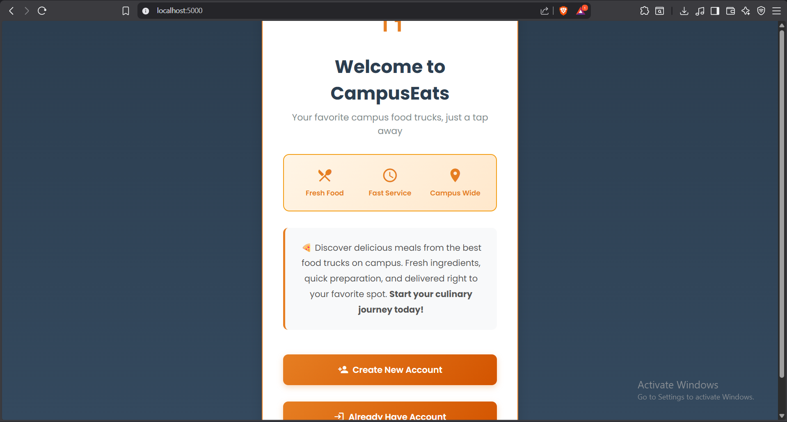
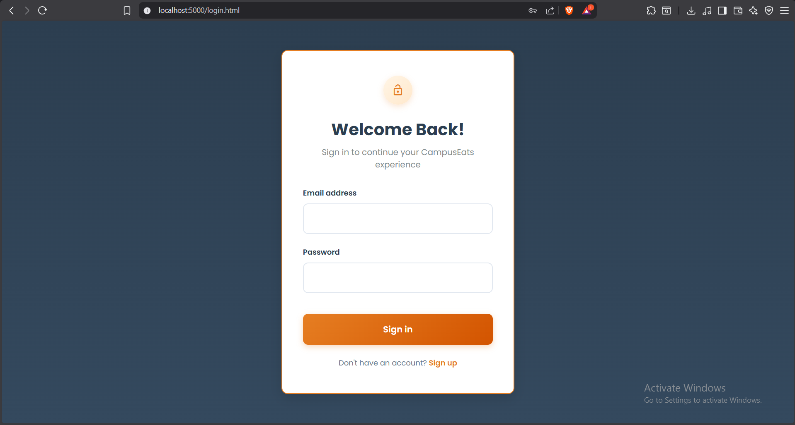
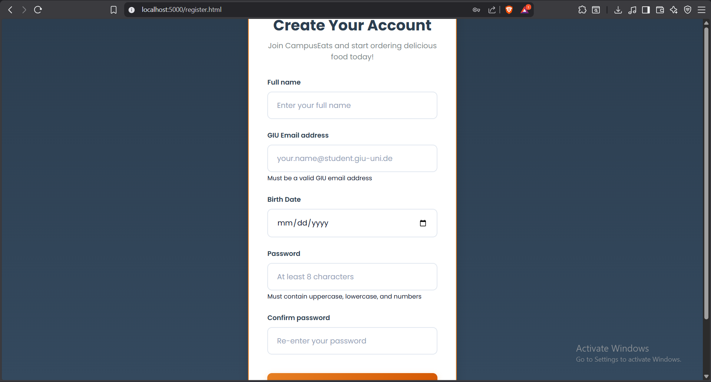
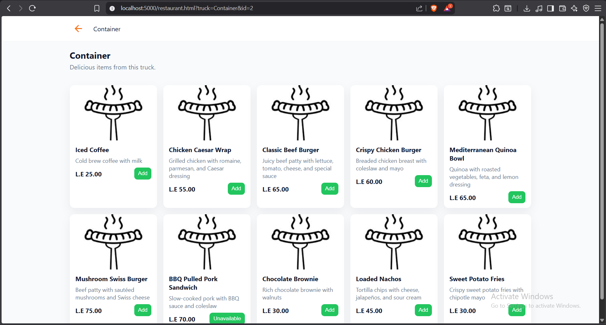
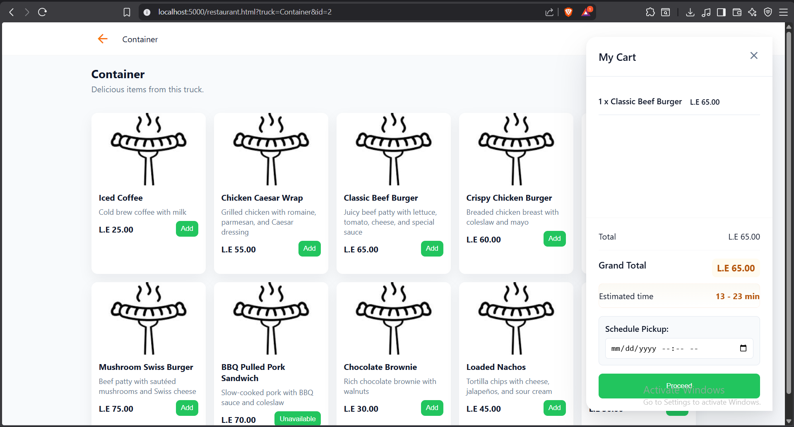
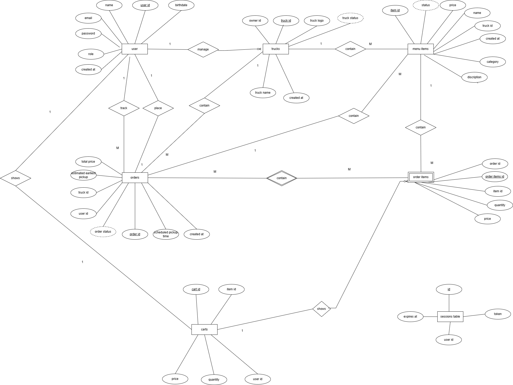

<div align="center">

# 🍔 GIU Food Truck Order Management System

### *Revolutionizing Campus Dining Through Digital Innovation*

[](https://nodejs.org/)
[](https://www.postgresql.org/)
[](https://expressjs.com/)
[](https://jwt.io/)
[](#-license)
[](http://makeapullrequest.com)

[Overview](#-overview) • [Features](#-features) • [Tech Stack](#-technology-stack) • [Quick Start](#-quick-start) • [Documentation](#-documentation) • [Team](#-team-sleepers)

</div>

---

## 📋 Overview

The **GIU Food Truck Order Management System** is a comprehensive web-based platform that revolutionizes campus dining by eliminating waiting lines and streamlining the ordering process.

Students and staff can browse menus from multiple food trucks, place orders with scheduled pickup times, and track order status in real-time. Food truck operators manage incoming orders, update menu items, and control their operational status through an intuitive vendor dashboard.

> **Academic Context:** Developed as part of the **Software Engineering (CSEN 303)** course, WS 2025/26  
> **Methodology:** Agile Software Development with an evolving SRS document

---

## ✨ Features

<table>
<tr>
<td width="33%" valign="top">

### 👥 For Customers
- 🔐 Secure registration and login (GIU email only)
- 🍔 Browse food trucks and their menus
- 🛒 Add items to cart with scheduling
- 📍 View truck locations and status (open/busy/closed)
- 📦 Track order status (received → preparing → ready)
- ⏰ Schedule pickup times
- 📱 Responsive web design for mobile/desktop

</td>
<td width="33%" valign="top">

### 🍕 For Vendors
- 📊 Vendor dashboard with order management
- 🍕 Add/edit/remove menu items
- ✅ Update order statuses
- 🚫 Activate "busy mode" to pause orders
- 📈 View order statistics and history
- 📋 Real-time order notifications
- 💼 Business analytics

</td>
<td width="33%" valign="top">

### 🔧 For Administrators
- 👥 User management
- 🚚 Add/remove food trucks
- 📊 Platform-wide statistics
- 🛡️ System monitoring
- 📈 Analytics dashboard
- ⚙️ Configuration management
- 🔐 Security controls

</td>
</tr>
</table>

---

## �️ Frontend Pages (Milestone 4)

### Page Overview

| Page | Route | Description | Role |
|------|-------|-------------|------|
| **Login** | `/login.html` | User authentication | Public |
| **Register** | `/register.html` | New user registration | Public |
| **Dashboard** | `/dashboard.html` | Customer homepage with trucks | Customer |
| **Restaurant Menu** | `/restaurant.html?id=X` | View truck menu items | Customer |
| **Order Tracking** | `/track.html` | Track order status | Customer |
| **Vendor Dashboard** | `/vendor-dashboard.html` | Truck owner management | Truck Owner |
| **Admin Panel** | `/admin.html` | System administration | Admin |

### Customer Pages

1. **Login Page** (`/login.html`)
   - Email and password authentication
   - Form validation
   - Redirect to dashboard on success
   - Link to registration

2. **Register Page** (`/register.html`)
   - Name, email, password, birth date fields
   - GIU email validation
   - Password strength requirements
   - Redirect to login on success

3. **Dashboard** (`/dashboard.html`)
   - Browse all available food trucks
   - Quick cart access (sidebar)
   - Search and filter trucks
   - Navigate to truck menus

4. **Restaurant Menu** (`/restaurant.html`)
   - View all menu items for selected truck
   - Add items to cart with quantity
   - Category filtering
   - Real-time cart updates

5. **Order Tracking** (`/track.html`)
   - View current order status
   - Order details with items
   - Estimated pickup time
   - Status updates (pending → preparing → ready)

### Vendor Pages

6. **Vendor Dashboard** (`/vendor-dashboard.html`)
   - Overview with statistics
   - Quick actions (Add Menu Item, Toggle Busy Mode)
   - Menu Items Management (CRUD)
   - Order Management with status updates
   - Settings (truck info, busy mode toggle)

### Screenshots

> **Note:** Screenshots are included in the `docs/screenshots/` folder for submission.

#### Public Pages

| Page | Screenshot |
|------|------------|
| Homepage |  |
| Login |  |
| Register |  |

#### Customer Pages

| Page | Screenshot |
|------|------------|
| Customer Dashboard |  |
| Restaurant Menu |  |
| Cart |  |
| Order Tracking |  |

#### Vendor Pages

| Page | Screenshot |
|------|------------|
| Vendor Overview |  |
| Vendor Order Management |  |
| Vendor Menu Management |  |
| Vendor Settings |  |

#### Admin Pages

| Page | Screenshot |
|------|------------|
| Admin Dashboard |  |
| Admin User Management |  |
| Admin Food Trucks Management |  |

---

## 🛠 Dashboard |  |

---

## �🛠 Technology Stack

<table>
<tr>
<td align="center" width="20%">

<br><strong>HTML5</strong>
</td>
<td align="center" width="20%">

<br><strong>CSS3</strong>
</td>
<td align="center" width="20%">

<br><strong>JavaScript</strong>
</td>
<td align="center" width="20%">

<br><strong>Node.js</strong>
</td>
<td align="center" width="20%">

<br><strong>Express.js</strong>
</td>
</tr>
<tr>
<td align="center" width="20%">

<br><strong>PostgreSQL</strong>
</td>
<td align="center" width="20%">

<br><strong>JWT Auth</strong>
</td>
<td align="center" width="20%">

<br><strong>Git</strong>
</td>
<td align="center" width="20%">

<br><strong>GitHub</strong>
</td>
<td align="center" width="20%">

<br><strong>VS Code</strong>
</td>
</tr>
</table>

### Core Technologies

| Layer | Technology | Purpose |
|-------|-----------|---------|
| **Frontend** | HTML5, CSS3, Vanilla JavaScript | Client-side interface and interactions |
| **Backend** | Node.js, Express.js | RESTful API server and business logic |
| **Database** | PostgreSQL 13+ | Relational data persistence with ACID compliance |
| **Authentication** | JWT + bcrypt | Secure token-based authentication with password hashing |
| **Development** | Nodemon, dotenv | Hot-reload development and environment configuration |

---

## 📁 Project Structure

```
Order-management-system/
│
├── 📂 backend/                     # Backend API Server
│   ├── 📂 config/
│   │   └── db.js                   # PostgreSQL connection pool
│   ├── 📂 controllers/
│   │   ├── authController.js       # Authentication logic
│   │   └── trucksController.js     # Truck management
│   ├── 📂 models/
│   │   └── userModel.js            # User data access layer
│   └── 📂 routes/
│       ├── authRoutes.js           # Auth endpoints
│       └── trucksRoutes.js         # Truck endpoints
│
├── 📂 database/                    # Database Layer
│   ├── 📄 schema.sql               # Complete database schema (5 tables, 3 views)
│   ├── 📄 setup.ps1                # Automated setup script
│   ├── 📄 utilities.sql            # Maintenance & health check queries
│   ├── 📄 api_queries.sql          # API query examples
│   ├── 📄 test-connection.js       # Connection tester
│   ├── 📄 README.md                # Full database documentation
│   ├── 📄 QUICKSTART.md            # 5-minute setup guide
│   ├── 📄 DATABASE_SUMMARY.md      # Schema overview
│   ├── 📂 migrations/              # Future schema migrations
│   └── 📂 seeds/                   # Sample data (50+ records)
│       ├── seed_all.sql
│       ├── 01_seed_users.sql       # Admin, vendors, students
│       ├── 02_seed_food_trucks.sql # 5 food trucks
│       ├── 03_seed_menu_items.sql  # 30+ menu items
│       └── 04_seed_orders.sql      # Sample orders
│
├── 📂 docs/                        # Documentation
│   ├── SRS.tex                     # Software Requirements Specification
│   ├── SRS.pdf                     # Compiled SRS document
│   └── architecture/               # System diagrams
│
├── 📂 frontend/                    # Frontend Application
│   ├── 📂 public/
│   │   ├── 📂 css/
│   │   │   └── styles.css          # Main stylesheet
│   │   ├── 📂 js/
│   │   │   ├── auth.js             # Authentication handler
│   │   │   └── main.js             # Core client logic
│   │   ├── 📂 images/              # Static assets
│   │   ├── index.html              # Landing page
│   │   ├── homepage.html           # Main app page
│   │   ├── login.html              # Login form
│   │   ├── signup.html             # Registration form
│   │   ├── dashboard.html          # Vendor dashboard
│   │   ├── restaurant.html         # Menu browsing
│   │   └── track.html              # Order tracking
│   └── 📂 src/
│       ├── 📂 contexts/
│       └── 📂 utils/
│
├── 📂 middleware/                  # Express Middleware
│   ├── authMiddleware.js           # JWT verification
│   ├── errorHandler.js             # Global error handler
│   └── index.js                    # Middleware aggregator
│
├── 📄 .env.example                 # Environment variables template
├── 📄 package.json                 # Dependencies & scripts
├── 📄 server.js                    # Application entry point
├── 📄 SETUP_CHECKLIST.md           # Step-by-step setup guide
└── 📄 README.md                    # This file
```

---

## 🚀 Quick Start

### Prerequisites

Ensure you have the following installed on your system:

<table>
<tr>
<td align="center" width="33%">

<br><strong>Node.js</strong>
<br><code>>= 18.x</code>
<br><a href="https://nodejs.org/">Download</a>
</td>
<td align="center" width="33%">

<br><strong>PostgreSQL</strong>
<br><code>>= 13</code>
<br><a href="https://www.postgresql.org/download/">Download</a>
</td>
<td align="center" width="33%">

<br><strong>Git</strong>
<br><code>Latest</code>
<br><a href="https://git-scm.com/">Download</a>
</td>
</tr>
</table>

### Installation

#### 1️⃣ Clone the Repository

```powershell
git clone https://github.com/CakeRemix/Order-management-system.git
cd Order-management-system
```

#### 2️⃣ Install Dependencies

```powershell
npm install
```

#### 3️⃣ Configure Environment

```powershell
# Copy the example environment file
Copy-Item .env.example .env

# Edit .env with your database credentials
notepad .env
```

**Required Configuration:**

| Variable | Description | Example |
|----------|-------------|---------|
| `DB_PASSWORD` | Your PostgreSQL password | `your_secure_password` |
| `JWT_SECRET` | Random 32+ character string | `your_super_secret_jwt_key_here_32chars+` |
| `PORT` | Server port (optional) | `5000` |
| `NODE_ENV` | Environment mode | `development` |

#### 4️⃣ Setup Database

```powershell
cd database
.\setup.ps1
```

> **Tip:** Choose **"yes"** when prompted to seed sample data for testing

#### 5️⃣ Test Database Connection

```powershell
# From project root
node database/test-connection.js
```

**Expected Output:**
```
✅ Database connection successful
✅ All tables exist
✅ Sample data loaded
```

#### 6️⃣ Start the Server

```powershell
# Production mode
npm start

# Development mode (with auto-reload)
npm run dev
```

**Server Status:**
```
🚀 Server running on http://localhost:5000
✅ Database connected
📊 Environment: development
```

#### 7️⃣ Open in Browser

Navigate to: **[http://localhost:5000](http://localhost:5000)**

---

## 📊 Database Architecture

### Entity Relationship Diagram (ERD)



> The complete ERD diagram showing all entities, relationships, and attributes in the GIU Food Truck System.

### Database Tables Summary

| Table | Description | Key Fields |
|-------|-------------|------------|
| **Users** | System users (customers, vendors, admins) | userId, email, role, password |
| **Trucks** | Food truck information | truckId, truckName, ownerId, status |
| **MenuItems** | Menu items per truck | itemId, truckId, name, price, category |
| **Orders** | Customer orders | orderId, userId, truckId, status, totalPrice |
| **OrderItems** | Line items in orders | orderItemId, name, quantity, price |
| **Carts** | Shopping cart items | cartId, userId, itemId, quantity |
| **Sessions** | Authentication tokens | id, userId, token, expiresAt |

### Schema Overview

<table>
<tr>
<td width="50%">

#### Core Components
- **7 Core Tables:** `users`, `trucks`, `menu_items`, `orders`, `order_items`, `carts`, `sessions`
- **3 Custom ENUMs:** `user_role`, `order_status`, `truck_status`
- **3 Materialized Views:** `active_orders_view`, `menu_items_with_truck`, `vendor_stats`
- **Triggers:** Auto-update timestamps, generate order numbers
- **Functions:** Order calculations, truck availability checks
- **Constraints:** Foreign keys, unique constraints, check constraints

</td>
<td width="50%">

#### Key Features
- ✅ **ACID Compliance** — Full transactional integrity
- 🔒 **Row-Level Security** — Role-based access control
- 🗂️ **Soft Deletes** — Data preservation with `deleted_at` columns
- 🔐 **Password Security** — bcrypt hashing with salt
- 📈 **Indexing** — Optimized query performance
- 🔄 **Auto-timestamps** — Created/updated tracking

</td>
</tr>
</table>
### Quick Database Commands

```powershell
# Health check with detailed diagnostics
psql -U postgres -d giu_food_truck_db -f database/utilities.sql

# View all tables with row counts
psql -U postgres -d giu_food_truck_db -c "\dt+"

# View database schema
psql -U postgres -d giu_food_truck_db -c "\d"

# Check active connections
psql -U postgres -d giu_food_truck_db -c "SELECT * FROM pg_stat_activity;"

# Reset database (drop & recreate)
cd database
.\setup.ps1  # Choose "yes" to drop and recreate
```

### Database Documentation

| Document | Description |
|----------|-------------|
| 📄 [README.md](database/README.md) | Comprehensive database documentation (schema, queries, maintenance) |
| ⚡ [QUICKSTART.md](database/QUICKSTART.md) | 5-minute setup guide for new developers |
| 📊 [DATABASE_SUMMARY.md](database/DATABASE_SUMMARY.md) | High-level architecture overview |
| 🔍 [api_queries.sql](database/api_queries.sql) | Example queries for API development |
| 🛠️ [utilities.sql](database/utilities.sql) | Maintenance and diagnostic queries |

---

## 🧪 Test Accounts

> **Universal Password:** All test accounts use `Test123!`

<table>
<tr>
<td width="33%" valign="top">

### 👑 Administrator
- `admin@giu-uni.de`

**Capabilities:**
- Full system access
- User management
- Truck management
- Analytics dashboard

</td>
<td width="33%" valign="top">

### 🍔 Vendors
**One vendor per food truck:**

- `demeshq.vendor@giu-uni.de`
- `container.vendor@giu-uni.de`
- `essens.vendor@giu-uni.de`
- `ftarwasha.vendor@giu-uni.de`
- `loaded.vendor@giu-uni.de`

**Capabilities:**
- Order management
- Menu editing
- Status updates

</td>
<td width="33%" valign="top">

### 🎓 Students (Team Members)
- `hassan.yousef@student.giu-uni.de`
- `sara.adel@student.giu-uni.de`
- `hana.yasser@student.giu-uni.de`
- `khaled.khaled@student.giu-uni.de`
- `omar.hani@student.giu-uni.de`
- `mohamed.walid@student.giu-uni.de`
- *...and more*

**Capabilities:**
- Browse menus
- Place orders
- Track orders

</td>
</tr>
</table>

### Quick Login

```javascript
// Example login credentials
{
  "email": "hassan.yousef@student.giu-uni.de",
  "password": "Test123!"
}
```

---

## 📖 Documentation

<table>
<tr>
<td align="center" width="25%">
<br>📄<br><strong>SRS Document</strong><br>
<a href="docs/SRS.tex">SRS.tex</a><br>
<sub>Complete requirements specification</sub>
</td>
<td align="center" width="25%">
<br>💾<br><strong>Database Docs</strong><br>
<a href="database/README.md">README.md</a><br>
<sub>Full database documentation</sub>
</td>
<td align="center" width="25%">
<br>⚡<br><strong>Quick Start</strong><br>
<a href="database/QUICKSTART.md">QUICKSTART.md</a><br>
<sub>5-minute setup guide</sub>
</td>
<td align="center" width="25%">
<br>🔍<br><strong>API Queries</strong><br>
<a href="database/api_queries.sql">api_queries.sql</a><br>
<sub>Example queries for development</sub>
</td>
</tr>
</table>

---

## 🏗️ API Endpoints

### API v1 Endpoints (Milestone 3 & 4)

#### Public Endpoints

| Method | Endpoint | Description | Auth Required |
|--------|----------|-------------|---------------|
| `POST` | `/api/auth/signup` | Register new user | ❌ |
| `POST` | `/api/auth/login` | User login | ❌ |
| `GET` | `/api/v1/trucks/view` | View all available trucks | ❌ |
| `GET` | `/api/v1/menuItem/truck/:truckId` | View truck menu | ❌ |
| `GET` | `/api/v1/menuItem/truck/:truckId/category/:category` | Filter menu by category | ❌ |

#### Customer Endpoints

| Method | Endpoint | Description | Auth Required |
|--------|----------|-------------|---------------|
| `GET` | `/api/auth/me` | Get current user profile | ✅ |
| `POST` | `/api/v1/cart/new` | Add item to cart | ✅ Customer |
| `GET` | `/api/v1/cart/view` | View cart | ✅ Customer |
| `PUT` | `/api/v1/cart/edit/:cartId` | Update cart quantity | ✅ Customer |
| `DELETE` | `/api/v1/cart/delete/:cartId` | Remove from cart | ✅ Customer |
| `POST` | `/api/v1/order/new` | Place order | ✅ Customer |
| `GET` | `/api/v1/order/myOrders` | View my orders | ✅ Customer |
| `GET` | `/api/v1/order/details/:orderId` | View order details | ✅ Customer |

#### Truck Owner Endpoints

| Method | Endpoint | Description | Auth Required |
|--------|----------|-------------|---------------|
| `POST` | `/api/v1/menuItem/new` | Create menu item | ✅ Truck Owner |
| `GET` | `/api/v1/menuItem/view` | View my menu items | ✅ Truck Owner |
| `GET` | `/api/v1/menuItem/view/:itemId` | View specific item | ✅ Truck Owner |
| `PUT` | `/api/v1/menuItem/edit/:itemId` | Edit menu item | ✅ Truck Owner |
| `DELETE` | `/api/v1/menuItem/delete/:itemId` | Delete menu item | ✅ Truck Owner |
| `GET` | `/api/v1/trucks/myTruck` | View my truck info | ✅ Truck Owner |
| `PUT` | `/api/v1/trucks/updateOrderStatus` | Update availability | ✅ Truck Owner |
| `GET` | `/api/v1/order/truckOwner/:orderId` | View order details | ✅ Truck Owner |
| `GET` | `/api/v1/order/truckOrders` | View truck orders | ✅ Truck Owner |
| `PUT` | `/api/v1/order/updateStatus/:orderId` | Update order status | ✅ Truck Owner |

#### Admin Endpoints

| Method | Endpoint | Description | Auth Required |
|--------|----------|-------------|---------------|
| `GET` | `/api/admin/users` | Get all users | ✅ Admin |
| `PATCH` | `/api/admin/users/:id/role` | Update user role | ✅ Admin |
| `DELETE` | `/api/admin/users/:id` | Delete user | ✅ Admin |
| `GET` | `/api/admin/trucks` | Get all trucks (admin view) | ✅ Admin |
| `POST` | `/api/admin/trucks` | Create truck with vendor | ✅ Admin |
| `DELETE` | `/api/admin/trucks/:id` | Delete truck | ✅ Admin |
| `GET` | `/api/admin/stats` | Get system statistics | ✅ Admin |

### Health & Status

| Method | Endpoint | Description | Auth Required |
|--------|----------|-------------|---------------|
| `GET` | `/health` | Server and database status | ❌ |
| `GET` | `/api/status` | API service status | ❌ |

### Request Examples

#### Signup

```bash
curl -X POST http://localhost:5000/api/auth/signup \
  -H "Content-Type: application/json" \
  -d '{
    "email": "user@student.giu-uni.de",
    "password": "SecurePass123!",
    "fullName": "John Doe",
    "role": "customer"
  }'
```

#### Login

```bash
curl -X POST http://localhost:5000/api/auth/login \
  -H "Content-Type: application/json" \
  -d '{
    "email": "user@student.giu-uni.de",
    "password": "SecurePass123!"
  }'
```

#### Get Current User

```bash
curl -X GET http://localhost:5000/api/auth/me \
  -H "Authorization: Bearer YOUR_JWT_TOKEN"
```

> **Coming Soon:** Orders, trucks, menu items, and cart endpoints

---

## 🗺️ Development Roadmap

### Phase 1: Foundation ✅ Completed

<table>
<tr>
<td width="50%">

**Backend Infrastructure**
- [x] PostgreSQL database schema (5 tables, 3 views)
- [x] Node.js/Express API server
- [x] JWT authentication system
- [x] bcrypt password hashing
- [x] RESTful API architecture
- [x] Environment configuration

</td>
<td width="50%">

**Frontend & Data**
- [x] HTML/CSS/JavaScript UI
- [x] Login & signup pages
- [x] Dashboard templates
- [x] Sample data seeding (50+ records)
- [x] 5 food trucks with menus
- [x] Test user accounts

</td>
</tr>
</table>

### Phase 2: Core Features 🚧 In Progress

- [ ] **Order Management API** — Create, read, update, delete orders
- [ ] **Menu Browsing** — View food trucks and menu items
- [ ] **Order Tracking** — Real-time status updates (pending → preparing → ready)
- [ ] **Vendor Dashboard** — Manage orders and menu items
- [ ] **Cart Functionality** — Add/remove items, calculate totals
- [ ] **Pickup Time Scheduling** — Select preferred pickup windows
- [ ] **Order History** — View past orders for customers
- [ ] **Busy Mode** — Vendors can pause incoming orders

**Target Completion:** December 2025

### Phase 3: Enhancement 📋 Planned

<table>
<tr>
<td width="33%">

**Integration**
- [ ] Payment gateway (Stripe/PayPal)
- [ ] University SSO authentication
- [ ] Email notifications
- [ ] SMS alerts
- [ ] Third-party APIs

</td>
<td width="33%">

**Features**
- [ ] Rating & review system
- [ ] Advanced analytics
- [ ] Inventory management
- [ ] Loyalty program
- [ ] Promotional codes

</td>
<td width="33%">

**Platform**
- [ ] Push notifications
- [ ] Mobile app (React Native)
- [ ] Progressive Web App (PWA)
- [ ] Multi-language support
- [ ] Dark mode

</td>
</tr>
</table>

**Target Completion:** Q1 2026
---

## 🧪 Development Workflow

### Running the Application

<table>
<tr>
<td width="50%">

#### Production Mode

```powershell
npm start
```

**Features:**
- Optimized for performance
- No auto-reload
- Production error handling
- Suitable for deployment

</td>
<td width="50%">

#### Development Mode

```powershell
npm run dev
```

**Features:**
- Hot-reload with nodemon
- Detailed error messages
- Development logging
- Fast iteration

</td>
</tr>
</table>

### Multi-Terminal Setup

```powershell
# Terminal 1: Backend server
npm run dev

# Terminal 2 (optional): Database monitoring
psql -U postgres -d giu_food_truck_db

# Terminal 3 (optional): Database logs
psql -U postgres -d giu_food_truck_db -c "SELECT * FROM pg_stat_activity;"
```

### Testing & Quality Assurance

#### API Testing

```powershell
# Health check
curl http://localhost:5000/health

# Test authentication
curl -X POST http://localhost:5000/api/auth/login \
  -H "Content-Type: application/json" \
  -d '{"email":"admin@giu-uni.de","password":"Test123!"}'
```

**Recommended Tools:**
- 🔥 [Postman](https://www.postman.com/) — API testing platform
- ⚡ [Thunder Client](https://www.thunderclient.com/) — VS Code extension
- 🐾 [Insomnia](https://insomnia.rest/) — REST client
- 🌐 [HTTPie](https://httpie.io/) — CLI HTTP client

#### Database Testing

```powershell
# Run connection test
node database/test-connection.js

# Check database health
psql -U postgres -d giu_food_truck_db -f database/utilities.sql

# Verify seed data
psql -U postgres -d giu_food_truck_db -c "SELECT COUNT(*) FROM users;"
```

### Troubleshooting Guide

<details>
<summary><strong>❌ Database connection fails</strong></summary>

```powershell
# 1. Check if PostgreSQL is running
Get-Service postgresql*

# 2. Verify connection parameters
node database/test-connection.js

# 3. Check database exists
psql -U postgres -c "\l"

# 4. Restart PostgreSQL service
Restart-Service postgresql-x64-13  # Adjust version number
```

</details>

<details>
<summary><strong>❌ Port 5000 already in use</strong></summary>

**Option 1: Change port in .env**
```env
PORT=3000
```

**Option 2: Kill process using port 5000**
```powershell
# Find process
netstat -ano | findstr :5000

# Kill process (replace PID)
taskkill /PID <PID> /F
```

</details>

<details>
<summary><strong>❌ bcrypt installation issues</strong></summary>

```powershell
# Clean install
Remove-Item node_modules -Recurse -Force
Remove-Item package-lock.json

# Rebuild bcrypt from source
npm install --build-from-source bcrypt

# Reinstall all dependencies
npm install
```

</details>

<details>
<summary><strong>❌ JWT token validation fails</strong></summary>

**Ensure JWT_SECRET is set in .env:**
```env
JWT_SECRET=your_super_secret_jwt_key_here_32chars+
```

**Generate a secure secret:**
```powershell
# PowerShell
[Convert]::ToBase64String([System.Text.Encoding]::UTF8.GetBytes((New-Guid).ToString()))
```

</details>

<details>
<summary><strong>❌ Frontend not loading</strong></summary>

```powershell
# 1. Check if server is running
curl http://localhost:5000/health

# 2. Clear browser cache
# Ctrl + Shift + Delete in most browsers

# 3. Check file paths in HTML
# Ensure CSS/JS paths are correct

# 4. Check console for errors
# Open browser DevTools (F12)
```

</details>

<div align="center">

## 👥 Team Sleepers

*Building the future of campus dining, one commit at a time* 🌙

</div>

<table>
<tr>
<td align="center" width="25%">
<br>
<strong>Hassan Yousef</strong><br>
<sub>Scrum Master</sub><br>
<code>13006567</code><br>
<a href="mailto:hassan.moahmed@student.giu-uni.de">📧 Email</a>
</td>
<td align="center" width="25%">
<br>
<strong>Sara Adel</strong><br>
<sub>Full Stack Engineer</sub><br>
<code>14003723</code><br>
<a href="mailto:sara.adel@student.giu-uni.de">📧 Email</a>
</td>
<td align="center" width="25%">
<br>
<strong>Hana Yasser</strong><br>
<sub>Full Stack Engineer</sub><br>
<code>13003628</code><br>
<a href="mailto:hana.ghallab@student.giu-uni.de">📧 Email</a>
</td>
<td align="center" width="25%">
<br>
<strong>Mohamed Walid</strong><br>
<sub>Full Stack Engineer</sub><br>
<code>13006513</code><br>
<a href="mailto:mohamed.mahdy@student.giu-uni.de">📧 Email</a>
</td>
</tr>
<tr>
<td align="center" width="25%">
<br>
<strong>Omar Hani</strong><br>
<sub>DevOps Engineer</sub><br>
<code>13007515</code><br>
<a href="mailto:omar.hani@student.giu-uni.de">📧 Email</a>
</td>
<td align="center" width="25%">
<br>
<strong>Abdelhamid ElSharnouby</strong><br>
<sub>Database Engineer</sub><br>
<code>13006294</code><br>
<a href="mailto:abdelhamid.mahmoud@student.giu-uni.de">📧 Email</a>
</td>
<td align="center" width="25%">
<br>
<strong>Hanin Mohamed</strong><br>
<sub>Full Stack Engineer</sub><br>
<code>13007010</code><br>
<a href="mailto:hanin.mohamed@student.giu-uni.de">📧 Email</a>
</td>
<td align="center" width="25%">
<br>
<strong>Khaled Khaled</strong><br>
<sub>Full Stack Engineer</sub><br>
<code>14001048</code><br>
<a href="mailto:khaled.khaled@student.giu-uni.de">📧 Email</a>
</td>
</tr>
</table>

---

## 🎓 Academic Context

<table>
<tr>
<td width="50%">

### Course Information

| | |
|---|---|
| **Course** | Software Engineering (CSEN 303) |
| **Semester** | Winter Semester 2025/26 |
| **University** | German International University (GIU) |
| **Methodology** | Agile Software Development |
| **Documentation** | Living SRS Document |

</td>
<td width="50%">

### Supervision Team

<table>
<tr>
<td align="center">
👨‍🏫<br>
<strong>Dr. Iman Awaad</strong><br>
<sub>Course Instructor</sub>
</td>
</tr>
<tr>
<td align="center">
👨‍💻<br>
<strong>Eng. Amir Haytham</strong><br>
<sub>Technical Supervisor</sub>
</td>
</tr>
<tr>
<td align="center">
👨‍💻<br>
<strong>Eng. Ahmad Sherif</strong><br>
<sub>Technical Supervisor</sub>
</td>
</tr>
</table>

</td>
</tr>
</table>

---

## 🤝 Contributing

We welcome contributions from team members! Follow these steps:

### Development Workflow

```bash
# 1. Create a feature branch
git checkout -b feature/amazing-feature

# 2. Make your changes and commit
git add .
git commit -m "feat: Add amazing feature"

# 3. Push to your branch
git push origin feature/amazing-feature

# 4. Open a Pull Request on GitHub
```

### Commit Message Convention

We follow [Conventional Commits](https://www.conventionalcommits.org/):

| Type | Description | Example |
|------|-------------|---------|
| `feat` | New feature | `feat: Add order tracking` |
| `fix` | Bug fix | `fix: Resolve login issue` |
| `docs` | Documentation | `docs: Update README` |
| `style` | Code style | `style: Format with prettier` |
| `refactor` | Code refactoring | `refactor: Optimize queries` |
| `test` | Tests | `test: Add auth tests` |
| `chore` | Maintenance | `chore: Update dependencies` |

### Code Review Process

1. **Self-review** your code before submitting PR
2. **Request review** from at least one team member
3. **Address feedback** and make requested changes
4. **Merge** after approval from reviewer(s)

---

## 📄 License & Usage

<div align="center">

```
Copyright © 2025 Team Sleepers - German International University

This project is submitted for academic evaluation under the 
Software Engineering (CSEN 303) course at GIU.

⚠️ Do not reuse without permission from the team and instructors.
```

**Academic Project** • **Not for Commercial Use** • **All Rights Reserved**

</div>

---

## 🙏 Acknowledgments

<table>
<tr>
<td align="center" width="33%">
👨‍🏫<br>
<strong>Dr. Iman Awaad</strong><br>
<sub>For project guidance and mentorship</sub>
</td>
<td align="center" width="33%">
👨‍💻<br>
<strong>Engineering Team</strong><br>
<sub>For technical support and code reviews</sub>
</td>
<td align="center" width="33%">
🎓<br>
<strong>GIU Community</strong><br>
<sub>For valuable feedback and testing</sub>
</td>
</tr>
</table>

---

## 📞 Support & Contact

<table>
<tr>
<td width="33%" align="center">

### 🐛 Report Issues
[Open an Issue](https://github.com/CakeRemix/Order-management-system/issues)

Found a bug? Have a suggestion?  
Submit an issue on GitHub

</td>
<td width="33%" align="center">

### 📧 Team Contact
[Team Email](mailto:hassan.yousef@student.giu-uni.de)

General inquiries and collaboration  
Contact team members via university email

</td>
<td width="33%" align="center">

### 📚 Documentation
[View Docs](/docs) • [Database](/database)

Comprehensive guides and references  
Check `/docs` and `/database` folders

</td>
</tr>
</table>

---

<div align="center">

## 📊 Project Status

| Metric | Status |
|--------|--------|
| **Version** | `1.0.0` |
| **Status** | 🚧 Active Development |
| **Last Updated** | November 30, 2025 |
| **Deployment** | 🔜 Coming Soon |
| **Test Coverage** | 📝 In Progress |
| **Documentation** | ✅ Complete |

---

### ⭐ If you found this project interesting, please consider giving it a star!

**Made with ❤️ by Team Sleepers**

*German International University • Software Engineering (CSEN 303) • Winter Semester 2025/26*

---

[](https://github.com/CakeRemix/Order-management-system)
[](https://github.com/CakeRemix/Order-management-system/fork)
[](https://github.com/CakeRemix/Order-management-system)

</div>
